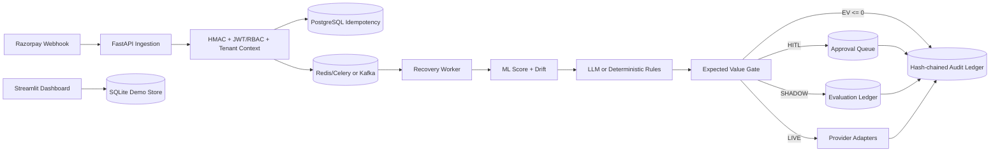

# RecoverAI Enterprise

> Agentic payment recovery platform with deterministic financial guardrails, human approval, cryptographic auditability, and a Streamlit dashboard.

[](https://recoverai-enterprise.streamlit.app)
[](https://www.python.org/)
[](#testing)
[](LICENSE)

RecoverAI processes failed payment events through ML scoring, deterministic fallback rules, expected-value economics, human-in-the-loop approval, shadow-mode simulation, provider dispatch adapters, and a tamper-evident audit ledger.

## Current Runtime Profiles

RecoverAI has two deliberately separate profiles:

| Profile | Purpose | Persistence | External dispatch |
|---|---|---|---|
| **Streamlit demo/staging** | Dashboard, synthetic data, review of counterfactual decisions | Explicit SQLite development store at `/tmp` | Disabled by default with `EXECUTION_MODE=SHADOW` |
| **API production** | Multi-tenant live processing | PostgreSQL through PgBouncer, with RLS and partitions | Requires Celery/Redis, credentials, and `EXECUTION_MODE=LIVE` |

**Production never silently falls back to SQLite or an in-process queue.** The API refuses production startup until PostgreSQL, distributed queue, JWT, audit, and encryption settings are present. The PostgreSQL schema and RLS migration is in [`migrations/001_enterprise_postgres.sql`](migrations/001_enterprise_postgres.sql).

## Features

| Capability | Implementation |
|---|---|
| Expected-value guardrail | `EV = (probability × recoverable amount) − (operational fee + gateway cost)`; EV ≤ 0 bypasses dispatch and writes an audit event. |
| Execution modes | `SHADOW` runs scoring and decisions but intercepts provider dispatch; `LIVE` permits dispatch after all gates pass. |
| Decision fallback | Primary LLM decisions fall back to deterministic rules and record the decision source. |
| Human approval | High-value, repeated-failure, high-discount, and ambiguous-score decisions enter the HITL queue. |
| Tenant authorization | JWT claims carry `sub`, `tenant_id`, and `role`; supported roles are `enterprise_admin`, `operator`, and `auditor`. |
| Audit ledger | SHA-256 hash chain plus keyed HMAC signature per row, with tamper-index reporting. |
| Sensitive data protection | AES-256-GCM encryption helpers and PII redaction before persistence or model calls. |
| Drift and tracing | KS/PSI drift metrics, Prometheus instrumentation, and OpenTelemetry spans. |
| Streamlit dashboard | Seven-tab dashboard with demo seeding, KPI views, audit verification, HITL review, and experiment views. |

## Architecture



## Run the Streamlit Dashboard

The dashboard is designed to run without the FastAPI API, Redis, PostgreSQL, or provider credentials. It uses the explicit development/staging profile and seeds synthetic data into `/tmp` on the first run.

```bash
git clone https://github.com/SumedhPatil1507/RecoverAI.git
cd RecoverAI
python3 -m venv .venv
source .venv/bin/activate
pip install -r requirements.txt
streamlit run streamlit_app.py
```

Open `http://localhost:8501`. For a clean local configuration, copy the template first:

```bash
cp .streamlit/secrets.toml.example .streamlit/secrets.toml
```

The dashboard defaults to `EXECUTION_MODE=SHADOW`. Use the sidebar’s **Seed Demo Data** action to generate another synthetic dataset.

### Streamlit Community Cloud

1. Create an app from repository `SumedhPatil1507/RecoverAI`.
2. Select branch `main` and file `streamlit_app.py`.
3. Paste the contents of [`.streamlit/secrets.toml.example`](.streamlit/secrets.toml.example) into the app’s Secrets editor.
4. Keep `ENVIRONMENT=staging`, `DATABASE_PATH=/tmp/recover_ai_enterprise.db`, and `EXECUTION_MODE=SHADOW` for the dashboard profile.
5. Do not set `ENVIRONMENT=production` for the Streamlit-only app. Production mode intentionally requires managed PostgreSQL and a distributed queue.

Streamlit Cloud storage is ephemeral. The demo dashboard is for evaluation and counterfactual analysis, not durable financial records.

## Run the FastAPI API Locally

The API can run in development mode with the local SQLite and asyncio queue paths:

```bash
ENVIRONMENT=development EXECUTION_MODE=SHADOW \
  uvicorn recover_ai.main:app --reload --port 8000
```

Useful endpoints include:

| Endpoint | Purpose |
|---|---|
| `GET /health` | Database, queue, and ledger health. |
| `POST /webhook/razorpay` | HMAC-authenticated asynchronous webhook ingestion. |
| `GET /api/v1/audit/verify` | Cryptographic audit verification. |
| `GET /api/hitl/queue` | Pending approval queue. |
| `POST /api/hitl/{hitl_id}/decide` | Operator/admin approval or rejection. |
| `GET /api/ml/drift` | Drift metrics and retraining state. |

To exercise the webhook path:

```bash
python recover_ai/data_simulator.py --burst 20
python recover_ai/data_simulator.py --chaos 500
```

## Production Deployment Contract

Production requires all of the following:

```bash
ENVIRONMENT=production
DATABASE_URL=postgresql://...       # use PgBouncer endpoint
USE_CELERY=1
REDIS_URL=redis://...
JWT_SECRET=...
AUDIT_HMAC_KEY=...
COLUMN_ENCRYPTION_KEY=...
EXECUTION_MODE=SHADOW              # promote to LIVE after validation
```

Run [`migrations/001_enterprise_postgres.sql`](migrations/001_enterprise_postgres.sql) before starting the API. PostgreSQL provides tenant-keyed tables, monthly range partitions, idempotency constraints, and Row Level Security policies based on `SET LOCAL app.tenant_id`.

The rollout recommendation is to start in `SHADOW`, compare the evaluation ledger with operations, enable managed PostgreSQL and Celery/Redis, and only then promote selected tenants to `LIVE`.

## Testing

Install development dependencies and run the enterprise regression suite:

```bash
pip install -r requirements-dev.txt
pytest -q tests/test_enterprise_controls.py tests/test_enterprise_flow.py
```

The suite covers HMAC verification, PII redaction, AES-256-GCM, audit-chain tamper detection, HITL state transitions, circuit breakers, ML drift, webhook acknowledgements, chaos webhook storms, EV edge cases, and RBAC behavior.

## Repository Structure

```text
RecoverAI/
├── streamlit_app.py
├── recover_ai/
│   ├── agent_engine.py          # scoring, decision, EV, HITL, shadow/live pipeline
│   ├── auth.py                  # JWT principal and RBAC helpers
│   ├── config.py                # fail-closed production configuration
│   ├── database.py              # local development ledger and data access
│   ├── expected_value.py        # exact-decimal financial decision engine
│   ├── main.py                  # FastAPI ingestion and operational endpoints
│   ├── queue_worker.py          # Celery/Redis production queue and local worker
│   └── security.py              # HMAC, PII redaction, and AES-GCM helpers
├── docs/
│   ├── enterprise-requirements.md
│   ├── implementation-plan.md
│   └── system-design.md
├── migrations/001_enterprise_postgres.sql
├── tests/
└── .streamlit/secrets.toml.example
```

## License

MIT — see [`LICENSE`](LICENSE).
