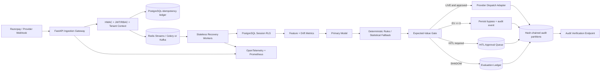

# RecoverAI Enterprise Tier — System Design

## Architecture

## Trust Boundaries

The webhook edge is an untrusted ingress boundary. It accepts only authenticated provider payloads and never trusts tenant identifiers supplied solely in the body. The worker boundary is separate from the request boundary. Worker execution is authenticated through the queue transport and is idempotent by event key. The database boundary enforces tenant isolation through PostgreSQL Row Level Security rather than relying solely on application filters.

## Data Flow

A webhook is verified, normalized to an immutable event envelope, deduplicated, and published. A worker loads tenant-scoped state, computes features, records model and drift telemetry, evaluates the primary model with a deterministic fallback, and applies the EV gate. The final branch is one of bypass, HITL, shadow ledger, or live provider dispatch. Every branch writes an audit event.

## Reliability Model

The queue uses at-least-once delivery. Idempotency is enforced at the database and transport layers. A transaction-level unique key prevents duplicate business effects. Failed jobs are retried with bounded exponential backoff and moved to a durable dead-letter queue after exhaustion. Provider adapters use circuit breakers and timeout budgets.

## Security Model

JWT claims identify the subject, tenant, and role. The role matrix is: enterprise administrators may manage tenant configuration and inspect all records within their tenant; operators may approve HITL actions and view operational records; auditors may read records and verify the ledger but may not mutate decisions or dispatch actions. Sensitive values are encrypted before persistence. The audit ledger uses both a hash chain and keyed signatures.

## Deployment Topology

Production runs stateless API replicas and worker replicas behind a load balancer. PostgreSQL Aurora or Supabase is fronted by PgBouncer. Redis or Kafka provides distributed transport. OpenTelemetry exports traces to the configured collector. Prometheus scrapes service metrics. Terraform and Kubernetes manifests define the deployable infrastructure.

## References

[1]: https://www.postgresql.org/docs/current/ddl-rowsecurity.html "PostgreSQL Row Security Policies"

[2]: https://redis.io/docs/latest/develop/data-types/streams/ "Redis Streams documentation"

[3]: https://opentelemetry.io/docs/concepts/signals/traces/ "OpenTelemetry traces"
